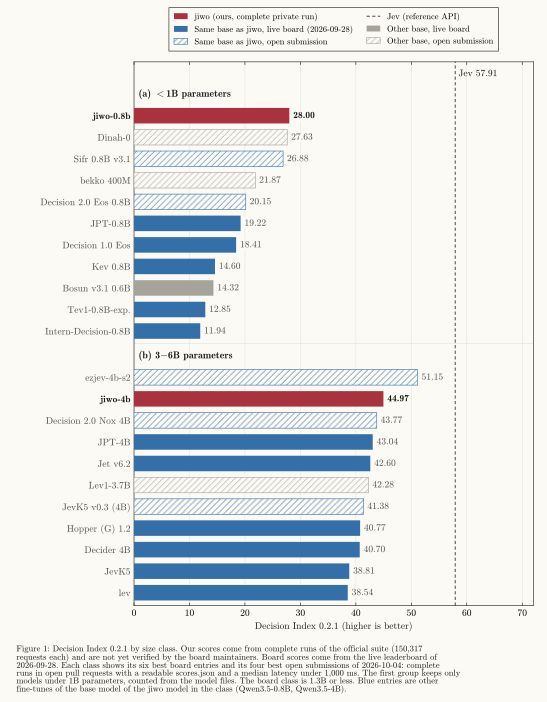

# jiwo

jiwo models read a state and typed questions, and return a probability for every option in one forward pass. They
do not generate text. On one H100, the median request takes about 50 ms.

The request and response format is the format of TypeSafe's Jev API (`POST /v1/systemone`). jiwo is an independent
project. TypeSafe does not endorse it.

## Models

On the [Decision Index](https://github.com/apolinario/decision-index), jiwo-0.8b has the highest score of all models
under 1B parameters. jiwo-4b is first in the 3–6B class of the live board, and second when open submissions are
included.

| Model | Base | Parameters | Decision Index 0.2.1 | Live board | Board and open submissions¹ | Licence |
|---|---|---:|---:|---|---|---|
| [jiwo-0.8b](https://huggingface.co/eljiwo/jiwo-0.8b) | [Qwen3.5-0.8B](https://huggingface.co/Qwen/Qwen3.5-0.8B) | 0.75B | **28.00** | 1st of 23 (under 1B) | 1st of 33 (under 1B) | Apache-2.0 |
| [jiwo-4b](https://huggingface.co/eljiwo/jiwo-4b) | [Qwen3.5-4B](https://huggingface.co/Qwen/Qwen3.5-4B) | 4.2B | **44.97** | 1st of 18 (3–6B) | 2nd of 27 (3–6B) | Apache-2.0 |

Against the untrained base model and the best other fine-tune of the same base model:

| Model | Untrained base² | Best other on the live board | Best other including open submissions¹ |
|---|---|---|---|
| jiwo-0.8b (28.00) | Qwen3.5-0.8B, 6.99: **+21.0 points** | JPT-0.8B, 19.22: **+45.7%** | Sifr 0.8B v3.1, 26.88: **+4.2%** |
| jiwo-4b (44.97) | Qwen3.5-4B, 29.20: **+15.8 points** | JPT-4B, 43.04: **+4.5%** | ezjev-4b-s2, 51.15: −12.1% |

¹ Complete runs in open pull requests (as of 2026-10-04) with a readable `scores.json` and a median latency under
1,000 ms, the limit of the board. The board's smallest class is 1.3B parameters or less. In that class, one open
submission scores higher than jiwo-0.8b: EXAONE-4.0-1.2B-JEV v0.3 (1.28B parameters, 30.29). One slower Qwen3.5-4B
submission also scores higher than jiwo-4b: Wald-Q4B v1.1 (54.59, median 2,360 ms).

² The untrained base model, run through the same server on the full suite, with its answer temperatures fitted on
the same calibration data as jiwo.



The scores come from complete runs of the suite (150,317 requests per model), served by `jiwo serve`. The board
maintainers did not verify them yet. The board ranks use the live board of 2026-09-28. The training data is mostly
English. Other languages are not evaluated.

## Install

jiwo needs Python 3.12.

```bash
pip install "jiwo @ git+https://github.com/jiwidi/jiwo"
```

Or work in a checkout with [uv](https://docs.astral.sh/uv/):

```bash
git clone https://github.com/jiwidi/jiwo
cd jiwo
uv sync                  # on NVIDIA GPUs, add --extra cuda for the fast linear-attention kernels
```

On a CPU, use float32 (the default). Torch has no fast bfloat16 matrix product on many CPUs. On Apple silicon,
bfloat16 is several times slower than float32.

## Quickstart

```python
from jiwo.model import DecisionModel

model = DecisionModel.from_pretrained("eljiwo/jiwo-0.8b")
question = {"type": "noul", "instructions": "The customer is angry."}
response = model.decide("Refund please, the parcel arrived crushed.", {"angry": question})
print(response["answers"]["angry"]["noul"])  # the probability that the statement is true
```

`from_pretrained` also accepts a local checkpoint directory. Use `eljiwo/jiwo-4b` for the larger model. The first
call downloads the model into the Hugging Face cache.

## Serve

```bash
JIWO_CHECKPOINT=eljiwo/jiwo-0.8b jiwo serve
```

The server listens on `127.0.0.1:8765`. It answers `POST /v1/systemone`. `GET /health` and `GET /v1/models` give the
status and the model name.

Send one request:

```bash
curl -s localhost:8765/v1/systemone -H 'content-type: application/json' -d '{
  "state": "Refund please, the parcel arrived crushed.",
  "questions": {
    "team":  {"type": "choice", "instructions": "Which team handles this?",
              "criteria": {"billing": "Payments and refunds", "shipping": "Damaged or lost parcels", "account": null}},
    "angry": {"type": "noul", "instructions": "The customer is angry."},
    "urgency": {"type": "score", "instructions": "How urgent is it?", "criteria": ["Not urgent", "Soon", "Now"]}}}'
```

The response has one answer for each question. The numbers below are synthetic. They show the format only.

```json
{
  "model": "jiwo-0.8b",
  "answers": {
    "team": {"type": "choice", "choice": "shipping", "confidence": 0.895,
             "probabilities": {"billing": 0.05, "shipping": 0.93, "account": 0.02}},
    "angry": {"type": "noul", "noul": 0.71},
    "urgency": {"type": "score", "score": 1.1, "confidence": 0.55,
                "legend": {"0": "Not urgent", "1": "Soon", "2": "Now"},
                "probabilities": {"0": 0.1, "1": 0.7, "2": 0.2}}
  },
  "usage": {"input_tokens": 312, "output_tokens": 0}
}
```

- `choice`: `choice` is the most probable option. `confidence` is `(p_best - 1/n) / (1 - 1/n)`.
- `score`: `score` is the expected level, from 0 to n - 1. `confidence` is 1 minus the expected distance to the most
  probable level, divided by the mean distance of the levels to the middle of the scale.
- `noul`: `noul` is the probability that the statement is true.
- `usage.input_tokens` is the number of prompt tokens. The model does not generate tokens.

To answer one request without a server, put the request in a file and run
`jiwo decide eljiwo/jiwo-0.8b request.json`. The command prints the response.

## Request format

A request has a `state` and named `questions`. The state is a string, a JSON object or a JSON array. A request can
have at most 64 questions. Each question has one of three types:

| Type | Meaning | `criteria` |
|---|---|---|
| `choice` | Pick one of the named options (at most 255) | An object that maps option keys to descriptions or `null` |
| `score` | Rate the state on 2 to 10 ordered levels | A list of level descriptions, lowest level first |
| `noul` | Decide whether a statement is true | Optional. Descriptions for the keys `true` and `false` |

`instructions` is optional. It is the question text, or the statement of a `noul` question.

The server gives these errors. The body is `{"error": {"message": "...", "type": "..."}}`.

| Status | Cause |
|---|---|
| 400 | The request is not valid. Or a prompt is longer than `JIWO_MAX_LENGTH`. Or a choice has more options than the model saw in training. Or the request does not fit in GPU memory. |
| 401 | `JIWO_API_KEY` is set and the request has no valid `Authorization: Bearer <key>` header. |
| 413 | The body is larger than `JIWO_MAX_BODY_BYTES`. |
| 503 | The model is not loaded. |

## Settings

The server reads its settings from the environment.

| Variable | Meaning | Default |
|---|---|---|
| `JIWO_CHECKPOINT` | A checkpoint directory or a Hugging Face repository id | required |
| `JIWO_DEVICE` | `cuda`, `mps` or `cpu` | the best available device |
| `JIWO_API_KEY` | If set, requests need `Authorization: Bearer <key>` | not set |
| `JIWO_MODEL_NAME` | The model name in responses | the name in the checkpoint, else the repository name, else `jiwo` |
| `JIWO_MAX_LENGTH` | The longest prompt in tokens. A longer prompt gets a 400 error. Nothing is truncated. | `8192` |
| `JIWO_BATCH_TOKENS` | The most padded tokens in one forward pass. It does not change the answers. | `262144` on CUDA, `16384` on CPU and MPS |
| `JIWO_MAX_BODY_BYTES` | The largest request body in bytes | `2000000` |
| `JIWO_CUDNN_ATTENTION` | `0` switches off the cuDNN attention kernel. Some Gemma 4 models need this. | on |
| `JIWO_HOST`, `PORT` | The address of the server | `127.0.0.1`, `8765` |

The server answers one request at a time. After a GPU out-of-memory error, it tries again with smaller batches. A CPU
gives no out-of-memory error before the system swaps. On a CPU, keep `JIWO_BATCH_TOKENS` small.

A checkpoint that holds a LoRA adapter needs the `lora` extra: `pip install "jiwo[lora] @ git+https://github.com/jiwidi/jiwo"`.

## Decision Index

jiwo has an engine for the [Decision Index](https://github.com/apolinario/decision-index) kit. The engine runs the
model in the kit's process. It uses the request code of the server, so it gives the same answers as the kit's
`http` engine against `jiwo serve` with the same settings.

The kit is not on PyPI. Install it from its repository, then install jiwo in the same environment:

```bash
git clone https://github.com/apolinario/decision-index
cd decision-index
git checkout 87d4650b42b377c0291a89c1f1a879f9b31082bf    # edition 0.2.1
pip install -e ".[rebuild]"
pip install "jiwo @ git+https://github.com/jiwidi/jiwo"
python -m decision_index pipeline --engine jiwo.index_engine:JiwoEngine --model eljiwo/jiwo-0.8b \
    --option max_length=65536 --out runs/jiwo-0.8b
```

The kit's README tells how to get the suite. Engine options use `--option key=value`: `revision`, `device`,
`max_length` (default 8192), `batch_tokens` (default 262144 on CUDA, 16384 on CPU and MPS), `cudnn_attention`
(default true) and `model_name` (the model name in responses). A prompt that is too long and a choice with too many
options become `unsupported`, as in the `http` engine. About 340 suite requests have a prompt longer than 8192
tokens, most of them in ToolRet. For a complete run, add `--option max_length=65536`.

## Development

```bash
uv sync
uv run hf download trl-internal-testing/tiny-Qwen3_5ForConditionalGeneration    # a tiny random test model
HF_HUB_OFFLINE=1 uv run pytest -q
uv run ruff check . && uv run ruff format --check . && uv run mypy
```

## License

The code is under the MIT license (see [LICENSE](LICENSE)). Each model has the license of its base model. Both
models above are Apache-2.0.
